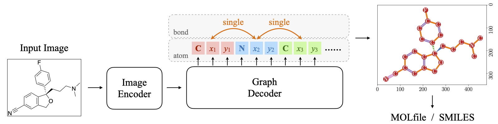

# MolScribe

This is the repository for MolScribe, an image-to-graph model that translates a molecular image to its chemical
structure. Try our [demo](https://huggingface.co/spaces/yujieq/MolScribe) on HuggingFace!



If you use MolScribe in your research, please cite our [paper](https://pubs.acs.org/doi/10.1021/acs.jcim.2c01480).
```
@article{
    MolScribe,
    title = {{MolScribe}: Robust Molecular Structure Recognition with Image-to-Graph Generation},
    author = {Yujie Qian and Jiang Guo and Zhengkai Tu and Zhening Li and Connor W. Coley and Regina Barzilay},
    journal = {Journal of Chemical Information and Modeling},
    publisher = {American Chemical Society ({ACS})},
    doi = {10.1021/acs.jcim.2c01480},
    year = 2023,
}
```

Please check out our subsequent works on parsing chemical diagrams:
- [RxnScribe](https://github.com/thomas0809/RxnScribe) (reaction diagram parsing):
[paper](https://pubs.acs.org/doi/10.1021/acs.jcim.3c00439),
[code](https://github.com/thomas0809/RxnScribe), [demo](https://huggingface.co/spaces/yujieq/RxnScribe)
- [OpenChemIE](https://github.com/CrystalEye42/OpenChemIE) (information extraction toolkit for chemistry literature): [paper](https://pubs.acs.org/doi/10.1021/acs.jcim.4c00572), [code](https://github.com/CrystalEye42/OpenChemIE), [demo](https://mit.openchemie.info)

## Quick Start

### Installation
Option 1: Install MolScribe with pip
```
pip install MolScribe
```

Option 2: Run the following command to install the package and its dependencies
```
git clone git@github.com:thomas0809/MolScribe.git
cd MolScribe
python setup.py install
```

### Example
Download the MolScribe checkpoint from [HuggingFace Hub](https://huggingface.co/yujieq/MolScribe/tree/main) 
and predict molecular structures:
```python
import torch
from molscribe import MolScribe
from huggingface_hub import hf_hub_download

ckpt_path = hf_hub_download('yujieq/MolScribe', 'swin_base_char_aux_1m.pth')

model = MolScribe(ckpt_path, device=torch.device('cpu'))
output = model.predict_image_file('assets/example.png', return_atoms_bonds=True, return_confidence=True)
```

The output is a dictionary, with the following format
```
{
    'smiles': 'Fc1ccc(-c2cc(-c3ccccc3)n(-c3ccccc3)c2)cc1',
    'molfile': '***', 
    'confidence': 0.9175,
    'atoms': [{'atom_symbol': '[Ph]', 'x': 0.5714, 'y': 0.9523, 'confidence': 0.9127}, ... ],
    'bonds': [{'bond_type': 'single', 'endpoint_atoms': [0, 1], 'confidence': 0.9999}, ... ]
}
```

Please refer to [`molscribe/interface.py`](molscribe/interface.py) and [`notebook/predict.ipynb`](notebook/predict.ipynb) 
for details and other available APIs.

For development or reproducing the experiments, please follow the instructions below.

## Experiments

### Requirements
Install the required packages
```
pip install -r requirements.txt
```

### Data
For training or evaluation, please download the corresponding datasets to `data/`.

Training data:

| Datasets                                                                            | Description                                                                                                                                   |
|-------------------------------------------------------------------------------------|-----------------------------------------------------------------------------------------------------------------------------------------------|
| USPTO <br> [Download](https://huggingface.co/yujieq/MolScribe/blob/main/uspto_mol.zip) | Downloaded from [USPTO, Grant Red Book](https://bulkdata.uspto.gov/).                                                                         |
| PubChem <br> [Download](https://huggingface.co/yujieq/MolScribe/blob/main/pubchem.zip) | Molecules are downloaded from [PubChem](https://ftp.ncbi.nlm.nih.gov/pubchem/Compound/), and images are dynamically rendered during training. |

Benchmarks:

| Category                                                                                   | Datasets                                      | Description                                                                                                                                                                                                                                |
|--------------------------------------------------------------------------------------------|-----------------------------------------------|--------------------------------------------------------------------------------------------------------------------------------------------------------------------------------------------------------------------------------------------|
| Synthetic <br> [Download](https://huggingface.co/yujieq/MolScribe/blob/main/synthetic.zip) | Indigo <br> ChemDraw                          | Images are rendered by Indigo and ChemDraw.                                                                                                                                                                                                |
| Realistic <br> [Download](https://huggingface.co/yujieq/MolScribe/blob/main/real.zip)      | CLEF <br> UOB <br> USPTO <br> Staker <br> ACS | CLEF, UOB, and USPTO are downloaded from https://github.com/Kohulan/OCSR_Review. <br/> Staker is downloaded from https://drive.google.com/drive/folders/16OjPwQ7bQ486VhdX4DWpfYzRsTGgJkSu. <br> ACS is a new dataset collected by ourself. |
| Perturbed <br> [Download](https://huggingface.co/yujieq/MolScribe/blob/main/perturb.zip)   | CLEF <br> UOB <br> USPTO <br> Staker          | Downloaded from https://github.com/bayer-science-for-a-better-life/Img2Mol/                                                                                                                                                                |


### Model
Our model checkpoints can be downloaded from [Dropbox](https://www.dropbox.com/sh/91u508kf48cotv4/AACQden2waMXIqLwYSi8zO37a?dl=0) 
or [HuggingFace Hub](https://huggingface.co/yujieq/MolScribe/tree/main).

Model architecture:
- Encoder: [Swin Transformer](https://github.com/microsoft/Swin-Transformer), Swin-B.
- Decoder: Transformer, 6 layers, hidden_size=256, attn_heads=8.
- Input size: 384x384

Download the model checkpoint to reproduce our experiments:
```
mkdir -p ckpts
wget -P ckpts https://huggingface.co/yujieq/MolScribe/resolve/main/swin_base_char_aux_1m680k.pth
```

### Prediction
```
python predict.py --model_path ckpts/swin_base_char_aux_1m680k.pth --image_path assets/example.png
```
MolScribe prediction interface is in [`molscribe/interface.py`](molscribe/interface.py).
See python script [`predict.py`](predict.py) or jupyter notebook [`notebook/predict.ipynb`](notebook/predict.ipynb)
for example usage.

### Evaluate MolScribe
```
bash scripts/eval_uspto_joint_chartok_1m680k.sh
```
The script uses one GPU and batch size of 64 by default. If more GPUs are available, update `NUM_GPUS_PER_NODE` and 
`BATCH_SIZE` for faster evaluation.

### Train MolScribe
```
bash scripts/train_uspto_joint_chartok_1m680k.sh
```
The script uses four GPUs and batch size of 256 by default. It takes about one day to train the model with four A100 GPUs.
During training, we use a modified code of [Indigo](https://github.com/epam/Indigo) (included in `molscribe/indigo/`).


### Evaluation Script
We implement a standalone evaluation script [`evaluate.py`](evaluate.py). Example usage:
```
python evaluate.py \
    --gold_file data/real/acs.csv \
    --pred_file output/uspto/swin_base_char_aux_1m680k/prediction_acs.csv \
    --pred_field post_SMILES
```
The prediction should be saved in a csv file, with columns `image_id` for the index (must match the gold file),
and `SMILES` for predicted SMILES. If prediction has a different column name, specify it with `--pred_field`.

The result contains three scores:
- canon_smiles: our main metric, exact matching accuracy.
- graph: graph exact matching accuracy, ignoring tetrahedral chirality.
- chiral: exact matching accuracy on chiral molecules.
